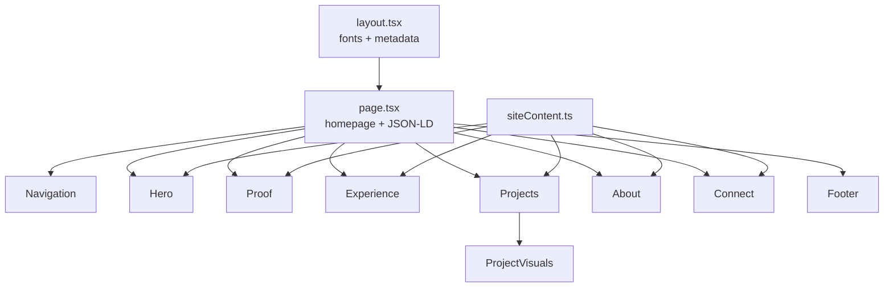

# Architecture

## Rendering model

The site is a statically generated Next.js App Router page. All current page components are React Server Components, so the content and navigation do not depend on client hydration.



Ordinary anchor links provide reliable section navigation. On smaller screens, the fixed navigation becomes a compact numbered index that mirrors the numbered section rail.

## Content model

[`src/data/siteContent.ts`](../src/data/siteContent.ts) is the canonical source for:

- Identity, location, availability, and positioning
- Career evidence and capabilities
- Work history
- Featured and supporting projects
- Personal story, interests, and community
- Professional and secondary links

Layout components should not introduce unsupported claims. Private projects can be described, but private source URLs and internal data must remain private.

## Design system

The aesthetic is "editorial field notes":

- Warm paper background
- Deep ink text and selected dark panels
- Restrained signal-orange accent
- Newsreader for expressive editorial type
- Manrope for interface and body text
- Thin rules, numbered section rails, and restrained concentric borders
- A real portrait and real project screenshots where public or available

The numbered section rail is the visual through-line. It should remain coherent when sections are reordered or added.

The responsive layout is defined in [`src/components/Portfolio.module.css`](../src/components/Portfolio.module.css). Major breakpoints are:

- `980px`: desktop navigation becomes the numbered index; complex grids simplify.
- `767px`: the hero and project layouts stack for phones.
- `390px`: the brand label collapses to the SM mark to preserve navigation space.

Animations are CSS-only, limited to opacity and transform, and disabled when `prefers-reduced-motion` is enabled.

## Assets

- Portrait: `public/images/steven-morano.png`
- Project screenshots: `public/projects/`
- Home Management is represented by a clearly labeled interface concept because the private product did not have a publishable screenshot available.

Never present a concept visual as a live product screenshot.

## SEO architecture

[`src/app/layout.tsx`](../src/app/layout.tsx) defines:

- Canonical URL
- Descriptive title and summary
- Open Graph and X/Twitter metadata
- Index/follow directives
- Author and publisher information

[`src/app/page.tsx`](../src/app/page.tsx) emits a Schema.org graph for `WebSite`, `ProfilePage`, and `Person`, including Steven's public professional profiles.

Static metadata routes provide:

- `/robots.txt`
- `/sitemap.xml`
- `/manifest.webmanifest`
- `/icon.svg`
- `/opengraph-image`

## Performance

- Static generation for every current route
- No Framer Motion or icon-library runtime
- Optimized local images through `next/image`
- Self-hosted font files generated by `next/font` at build time
- No forms, analytics SDKs, databases, or third-party embeds
- Minimal animation and a reduced-motion fallback

## Validation requirements

Every code change must pass:

```bash
npm run lint
npx tsc --noEmit
npm run build
```

Responsive visual review should cover at least 390px, 768px, and a standard desktop viewport.
